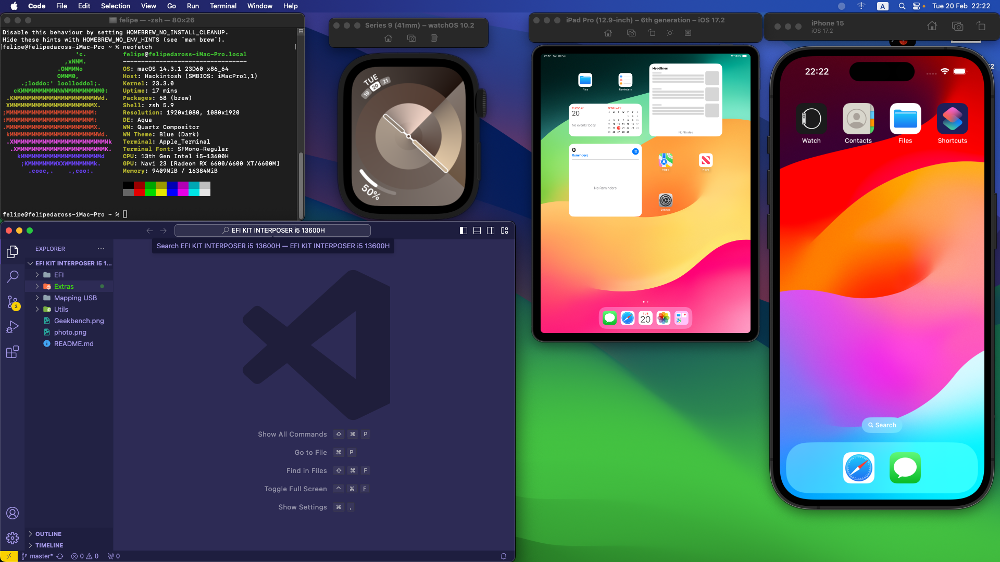

# KIT interposer i5 13600H

# EFI Details
**Latest working MacOS**: 14.5
 
**Current OpenCore**: 1.0.0
 
**Release date**: 25/05/2024

# EFI Timeline
**Working MacOS**: 14.4.0
 
**Current OpenCore**: 0.9.9
 
**Release date**: 00/03/2024

**Working MacOS**: 14.3.1
 
**Current OpenCore**: 0.9.8
 
**Release date**: 19/02/2024

# Computer specifications
|Item|Description|
|-|:-------:|
|CPU|Intel(R) Core(TM) i5-13600H
|Memory|16GB DDR5 (16Gx1) 5600MHz|
|Storage|NVMe ADATA XPG GAMING 512GB|
|GPU|RADEON RX 6600
|Ethernet|Intel's AND Realtek's 2.5Gb Ethernet.
|Wireless/BT| BCM94360CS2, NVME Adapter and 2 Antennas

# BIOS Settings

### Disable
- Fast Boot
- Secure Boot
- Serial/COM Port
- Parallel Port
- VT-d (can be enabled if you set `DisableIoMapper` to YES)
- Compatibility Support Module (CSM).
- Thunderbolt(For initial install, as Thunderbolt can cause issues if not setup correctly)
- Intel SGX
- Intel Platform Trust
- CFG Lock (MSR 0xE2 write protection)
    - This must be off, if you can't find the option then **`ENABLE`** `AppleXcpmCfgLock`. 
    - Your hack will not boot with `CFG-Lock` enabled.

### Enable
- VT-x
- Above 4G decoding. 
    - This must be on, if you can't find the option then add `npci=0x2000` to `boot-args`. 
    - Do not have both this option and `npci` on `boot-args` enabled at the same time.
    - When enabling Above4G, Resizable BAR Support may become an available on some motherboards. Please ensure this is **`DISABLED`** instead of set to Auto.
- Hyper-Threading
- Execute Disable Bit
- EHCI/XHCI Hand-off
- OS type: Windows 8.1/10 UEFI Mode
- SATA Mode: AHCI

# References
https://www.youtube.com/@UniversoHackintosh/featured
 
https://discord.universohackintosh.com.br